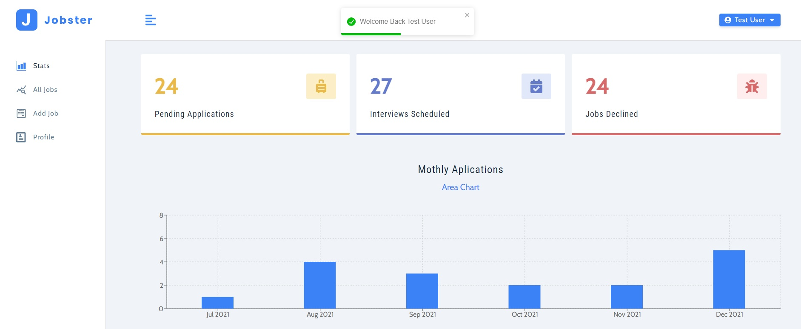
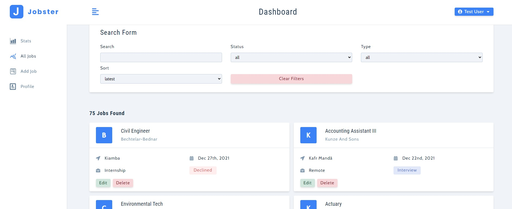
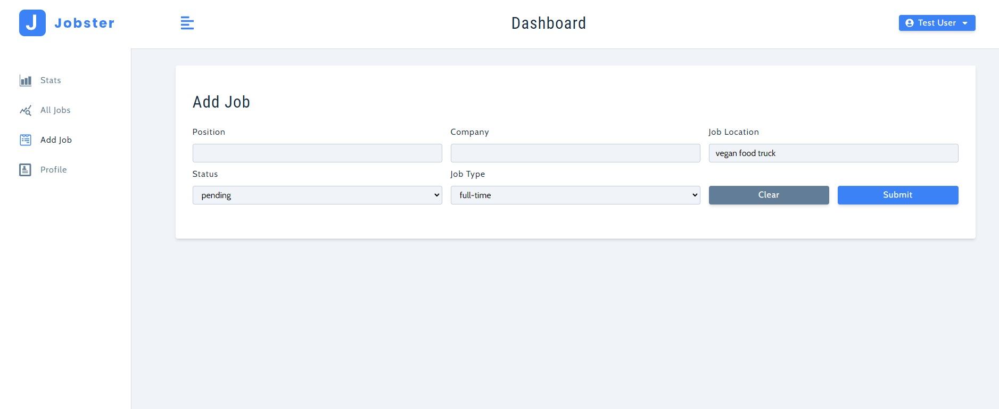
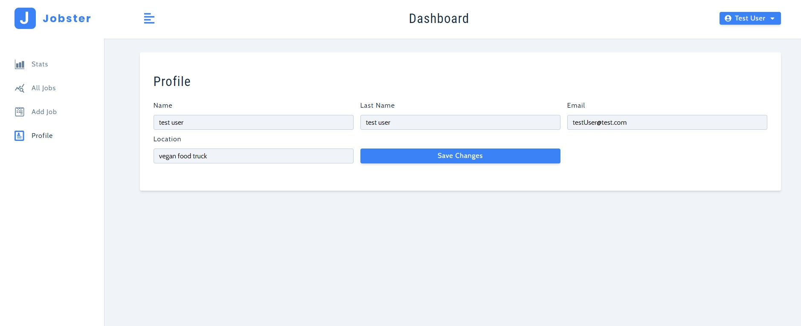
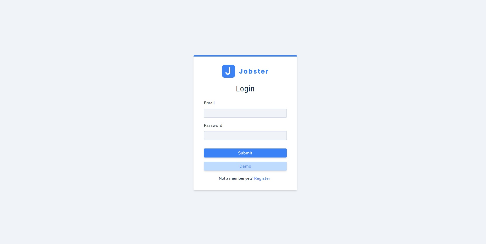

# Jobster

## Table of contents

- [Overview](#overview)
  - [Review](#Review)
  - [Screenshots](#screenshots)
  - [Link](#link)
  - [Built with](#built-with)
- [Author](#author)

## Overview

### Review

React based project: Jobster. You can create an account or try the demo version, it is possible to see the list of jobs, filter it and search, add a new one if you want, or delete or change it. You can also update user information.

### Screenshots

### Link

- Solution URL: [GitHub](https://github.com/nikamerebashvili95/jobster)

### Built with

- React
- API
- Hooks
- Reducer
- Router

## Author

- GitHub - [Nika Merebashvili](https://github.com/nikamerebashvili95)
- LinkedIn - [Nika Merebashvili](https://www.linkedin.com/in/nikamerebashvili)
- Portfolio - [Portfolio](https://nikamerebashvili95.github.io/portfolio-website/)

